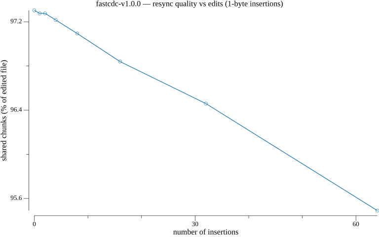
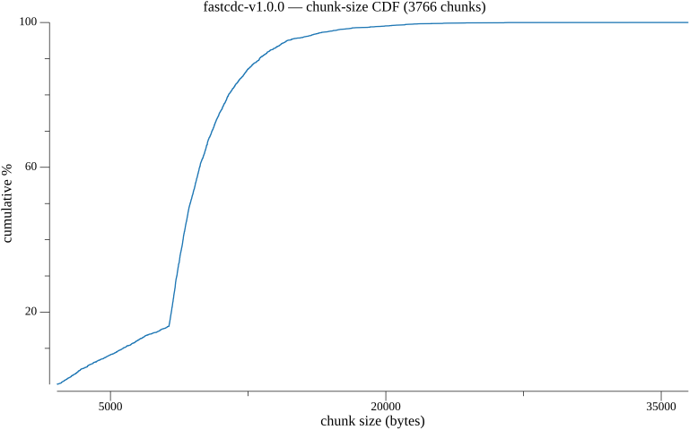
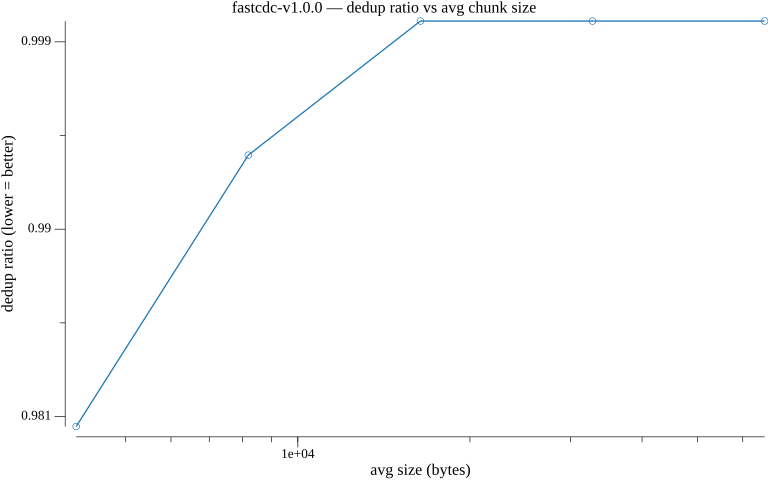
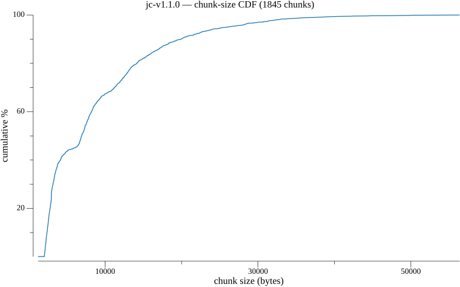
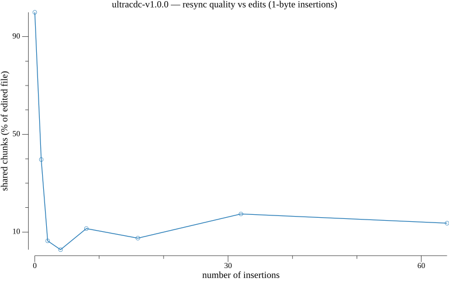
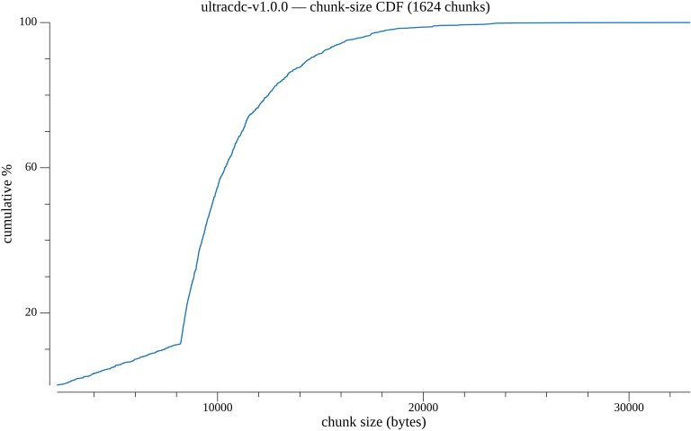
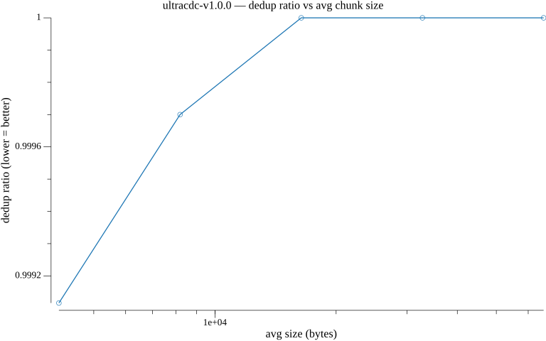

# go-cdc-chunkers

[](https://pkg.go.dev/github.com/PlakarKorp/go-cdc-chunkers)
[](https://goreportcard.com/report/github.com/PlakarKorp/go-cdc-chunkers)
[](https://codecov.io/gh/PlakarKorp/go-cdc-chunkers)
[](https://github.com/PlakarKorp/go-cdc-chunkers/actions/workflows/go.yml)

This is an active project !

Read our announcement post here: [Introducing go-cdc-chunkers: chunk and deduplicate everything](https://plakar.io/posts/2025-07-11/introducing-go-cdc-chunkers-chunk-and-deduplicate-everything/)

Feel free to join [our discord server](https://discord.gg/uuegtnF2Q5) or start discussions at Github.


## Overview
`go-cdc-chunkers` is a Golang package designed to provide unified access to multiple Content-Defined Chunking (CDC) algorithms.
With a simple and intuitive interface, users can effortlessly chunk data using their preferred CDC algorithm.

## Use-cases
Content-Defined Chunking (CDC) algorithms are used in data deduplication and backup systems to break up data into smaller chunks based on their content, rather than their size or location. This allows for more efficient storage and transfer of data, as identical chunks can be stored or transferred only once. CDC algorithms are useful because they can identify and isolate changes in data, making it easier to track and manage changes over time. Additionally, CDC algorithms can be optimized for performance, allowing for faster and more efficient processing of large amounts of data.


## Features
- Unified interface for multiple CDC algorithms.
- Supported algorithms: fastcdc, ultracdc, jc (each with a spec-faithful versioned variant).
- Efficient and optimized for performance.
- Comprehensive error handling.
- Supports KFastCDC, a Keyed variant of FastCDC for key-derived Gear

## Installation
```sh
go get github.com/PlakarKorp/go-cdc-chunkers
```


## Usage
Here's a basic example of how to use the package:

```go
    chunker, err := chunkers.NewChunker("fastcdc", rd)   // or ultracdc
    if err != nil {
        log.Fatal(err)
    }

    offset := 0
    for {
        chunk, err := chunker.Next()
        if err != nil && err != io.EOF {
            log.Fatal(err)
        }

        chunkLen := len(chunk)
        fmt.Println(offset, chunkLen)

        if err == io.EOF {
            // no more chunks to read
            break
        }
        offset += chunkLen
    }
```

## Benchmarks
Performance is a key feature in CDC. `go-cdc-chunkers` aims to balance usability,
CPU usage and memory usage.

The following compares chunking **1 GiB of random data** at `min=2 KiB`,
`avg=8 KiB`, `max=64 KiB` against other Go CDC implementations. Throughput is
higher-is-better; bytes and allocations per operation are lower-is-better.

```
goos: darwin
goarch: arm64
cpu: Apple M4 Pro
```

| Implementation              | Throughput | Chunks  | B/op      | allocs/op |
| --------------------------- | ---------: | ------: | --------: | --------: |
| PlakarKorp JC (v1.1.0)      | 3747 MB/s  | 130,901 |   131,306 |         5 |
| PlakarKorp JC (legacy)      | 3658 MB/s  | 130,901 |   131,306 |         5 |
| Tigerwill90 FastCDC         | 2412 MB/s  | 129,246 |   131,248 |         3 |
| Jotfs FastCDC               | 2242 MB/s  | 117,043 |   131,184 |         2 |
| PlakarKorp KeyedFastCDC     | 2229 MB/s  | 114,955 |   136,453 |         7 |
| Askeladdk FastCDC           | 2224 MB/s  | 105,327 |    43,701 |         1 |
| PlakarKorp FastCDC          | 2213 MB/s  | 114,876 |   131,306 |         5 |
| Mhofmann FastCDC            | 2188 MB/s  | 114,930 |    65,648 |         2 |
| PlakarKorp UltraCDC (v1.0.0)| 1821 MB/s  |  94,169 |   131,264 |         5 |
| PlakarKorp UltraCDC (legacy)| 1798 MB/s  |  94,207 |   131,264 |         5 |
| Restic Rabin                |  497 MB/s  |  16,875 | 3,329,797 |        46 |

> Throughput is not the whole story: implementations cut at different average
> sizes for identical options, and a faster chunker is only useful if its
> deduplication quality holds. Use the tooling below to compare quality, not
> just speed. Numbers are a snapshot from one machine — reproduce them with the
> benchmark harness rather than treating them as absolute.

The `B/op` above is dominated by the per-chunker scan buffer (`2×MaxSize`).
When running many chunkers concurrently, use `NewChunkerBuffer` with a
caller-owned buffer (`>= MaxSize`) — for example one pooled buffer per worker
goroutine — so peak memory scales with concurrency instead of with the number
of chunkers created.

## Tooling

Two command-line tools help decide whether a chunker (or a change to one) is
better, equivalent, or a regression.

`cmd/cdc` is dependency-free (it imports only this library) and prints numbers:

```sh
go run ./cmd/cdc analyze -chunker jc-v1.1.0 FILE...            # dedup ratio, size distribution, MB/s
go run ./cmd/cdc compare -a fastcdc-v1.0.0 -b jc-v1.1.0 FILE...  # side-by-side; non-zero exit on dedup regression
go run ./cmd/cdc resync  -a fastcdc-v1.0.0 -b jc-v1.1.0 FILE     # shared-chunk %% after small edits
```

`resync` is the important one for quality: it applies small insertions to a file
and measures how much of the edited file is still carried by chunks identical to
the original — the content-defined property deduplication actually relies on.

`cmd/cdcplot` renders those measurements as PNG graphs, one set per
implementation (`out/<algo>/`): chunk-size distribution, chunk-size CDF, resync
quality vs number of edits, and dedup ratio vs average chunk size. It lives in
its own module so its plotting dependency is never pulled into this library:

```sh
cd cmd/cdcplot && go run . -kind all -out /tmp/graphs -chunkers fastcdc-v1.0.0,jc-v1.1.0,ultracdc-v1.0.0 FILE...
```

### Visualizing chunker behaviour

The graphs below are produced by `cmd/cdcplot` over a sample input, one set per
implementation. The resync graph is the one to watch for quality: FastCDC and
JC keep most of the file shared after edits, whereas UltraCDC re-synchronises
less well on this input.

#### fastcdc-v1.0.0

| chunk-size distribution | resync impact |
| --- | --- |
|  |  |
| **chunk-size CDF** | **dedup ratio vs avg size** |
|  |  |

#### jc-v1.1.0

| chunk-size distribution | resync impact |
| --- | --- |
|  |  |
| **chunk-size CDF** | **dedup ratio vs avg size** |
|  |  |

#### ultracdc-v1.0.0

| chunk-size distribution | resync impact |
| --- | --- |
|  |  |
| **chunk-size CDF** | **dedup ratio vs avg size** |
|  |  |

## Contributing
We welcome contributions!
If you have a feature request, bug report, or wish to contribute code, please open an issue or pull request.

## Support
If you find `go-cdc-chunkers` useful, please consider supporting its development by [sponsoring the project on GitHub](https://github.com/sponsors/poolpOrg).
Your support helps ensure the project's continued maintenance and improvement.


## License
This project is licensed under the ISC License. See the [LICENSE.md](LICENSE.md) file for details.


## Reference

  - [Xia, Wen, et al. "Fastcdc: a fast and efficient content-defined chunking approach for data deduplication." 2016 USENIX Annual Technical Conference](https://www.usenix.org/system/files/conference/atc16/atc16-paper-xia.pdf)
  - [Zhou, Wang, Xia, Zhang "UltraCDC:A Fast and Stable Content-Defined Chunking Algorithm for Deduplication-based Backup Storage Systems" 2022 IEEE](https://ieeexplore.ieee.org/document/9894295)
  - [Xiaozhong Jin, Haikun Liu, Chencheng Ye, Xiaofei Liao, Hai Jin and Yu Zhang "Accelerating Content-Defined Chunking for Data Deduplication Based on Speculative Jump" IEEE TRANSACTIONS ON PARALLEL AND DISTRIBUTED SYSTEMS, VOL. 34, NO. 9, SEPTEMBER 2023](https://ieeexplore.ieee.org/stamp/stamp.jsp?tp=&arnumber=10168293)
  
